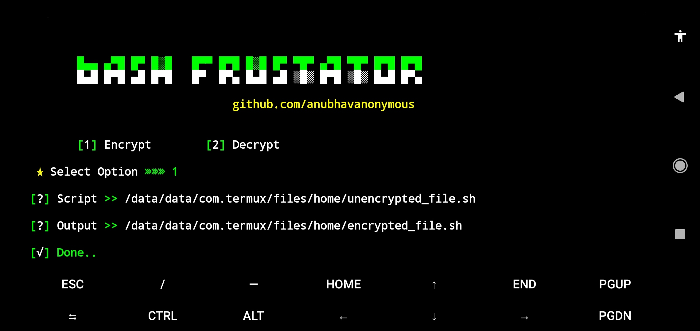

<br>


* `🔓 🔐 🔒`<br />
* `Shell script obfuscator and deobfuscator for Linux And Termux !`

## Usage
Install dependencies
```bash
pkg up -y;pkg install git -y;pkg install wget -y;pkg install curl -y;pkg install openssl -y;pkg install python2 -y;pip2 install requests;pip2 install mechanize;pip2 install bs4;pip2 install uncompyle6;npm install -g bash-obfuscate
```
Clone the repository
```bash
git clone https://github.com/anubhavanonymous/Bash_Frustator
```
Navigate to the directory
```bash
cd Bash_Frustator
```
Run the script
```bash
python2 frustator.py
```
## Screenshots (termux)
🎋 `encrypt`

<br>
<br>

🎋 `decrypt`

<br>
<br>
