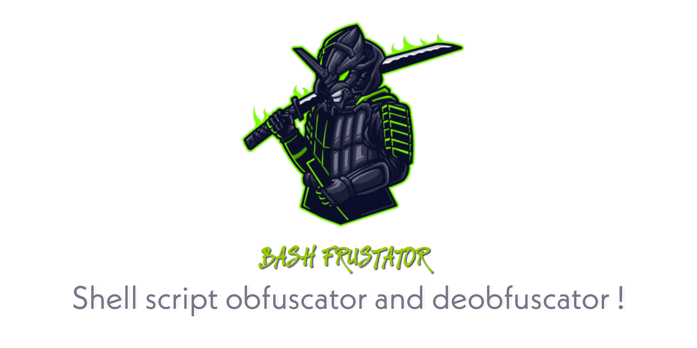

<h1 align="center">BASH FRUSTRATOR
<br>
</h1>


* `🔓 🔐 🔒`<br />
* `Shell script obfuscator and deobfuscator for Linux And Termux !`

## Usage
Clone it 
```bash
git clone https://github.com/anubhavanonymous/bash_frustator
```
Navigate to the Directory
```bash
cd bash_frustator
```
Install dependencies
```bash
pkg up -y
pkg install wget -y
pkg install curl -y
pkg install openssl -y
pkg install python2 -y
pip2 install requests
pip2 install mechanize
pip2 install bs4
pip2 install uncompyle6
npm install -g bash-obfuscate
```
Run the script
```bash
python2 frustrator.py
```
